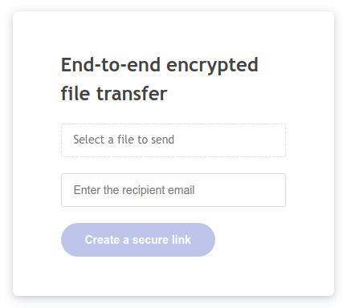

# FileKit

**[FileKit](https://tanker.io/)** is an end-to-end encrypted file storage service for apps.

**FileKit** stores and transfers files in the cloud. The files are encrypted in the browser before being uploaded, and
can be downloaded only by the owner and recipients, completely transparently.

It wraps Tanker **Core** and Tanker **VerificationUI** in a single easy-to-use to use package.

## Live demo

Here is an example of [what an application built with FileKit can do](https://tankerhq.github.io/filekit-tuto-app/).



## Getting started

To get started, you can read [the tutorial on creating a secure
file transfer app](https://docs.tanker.io/filekit/latest/tutorials/file-transfer/).

## Documentation

Our detailed documentation is available [here](https://docs.tanker.io/filekit/latest/).

## Example usage

```js
import FileKit from '@tanker/filekit';

// Initialize the FileKit object
const appId = 'Your app ID';
const filekit = new FileKit({ appId });

// Start a session
const email = 'alice@company.com';
const tankerIdentity = await yourServer.authenticate(email);
await fileKit.start(email, { identity: tankerIdentity });

// Encrypt and upload a file from <input type="file" id="fileInput" />
const fileToUpload = document.getElementById('fileInput').files[0];
const fileId = await fileKit.upload(fileToUpload);

// Download, decrypt, and save a file to disk
await fileKit.downloadToDisk(fileId);

// Download, decrypt, and get a File object
const file = await fileKit.download(fileId);
```
